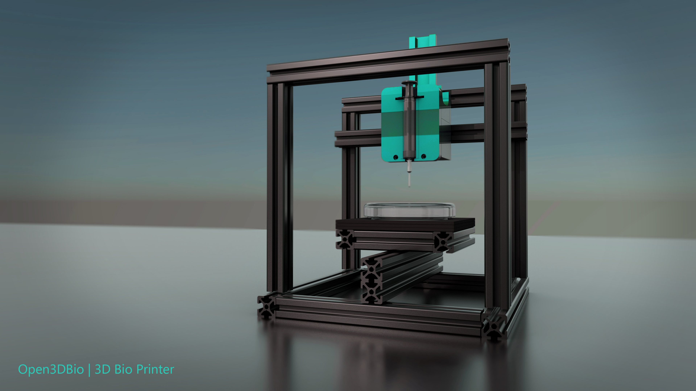

# Open3DBio
Open3DBio is an Open-Source 3D BioPrinting Platform designed to create customizable, high-precision Biological Structures for Research, Regenerative Medicine, and Innovative Applications in the Artistic, Cultural, and Creative Sectors.

